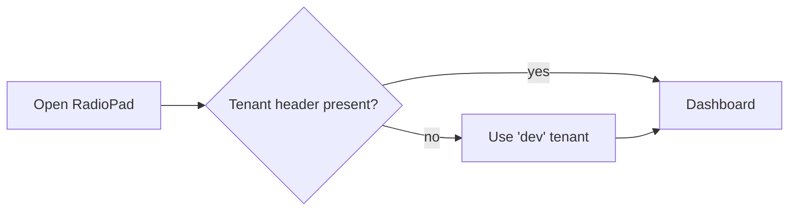
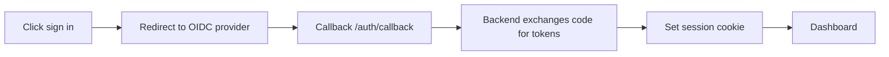
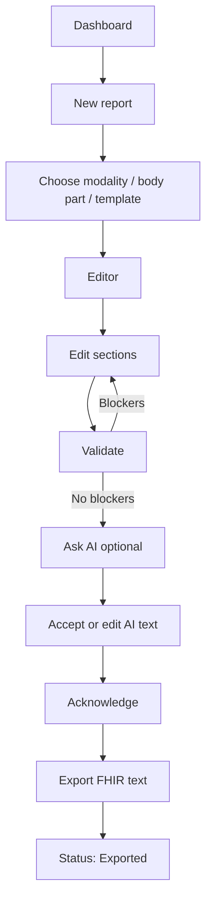
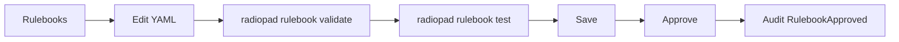
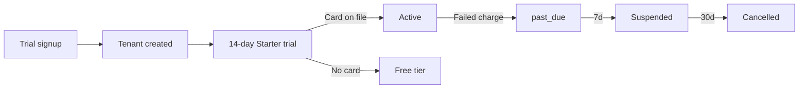

# User Flows

**Status:** Current  ·  **Owner:** Design  ·  **Last Updated:** 2026-05-04

## Onboarding (Phase 2 SSO; v0.1 dev mode)

## Login (planned, Phase 3)

## Draft & sign a report

## Admin: approve a rulebook

## Billing (planned)

## Error / recovery flows

- **Provider blocked by PHI policy** → `.banner.warn` "Provider not allowed for PHI" with a link to compliance docs.
- **Validation fails** → severity-grouped findings panel; one click to jump to the offending section.
- **Network failure** → toast with `X-Request-Id` so support can correlate.
