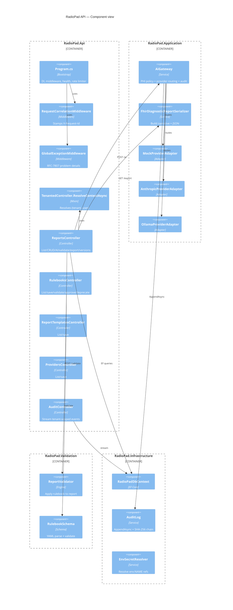

# C4 — Component (API)

**Status:** Current  ·  **Owner:** Engineering  ·  **Last Updated:** 2026-05-04

```mermaid
C4Component
  title RadioPad API — Component view

  Container_Boundary(api, "RadioPad.Api") {
    Component(prog, "Program.cs", "Bootstrap", "DI, middleware, health, rate limiter")
    Component(corr, "RequestCorrelationMiddleware", "Middleware", "Stamps X-Request-Id")
    Component(exc, "GlobalExceptionMiddleware", "Middleware", "RFC-7807 problem details")
    Component(tenant, "TenantedController.ResolveContextAsync", "Mixin", "Resolves (tenant, user)")
    Component(reports, "ReportsController", "Controller", "List/CRUD/AI/validate/export/versions")
    Component(rulebooks, "RulebooksController", "Controller", "List/save/validate/approve/deprecate")
    Component(templates, "ReportTemplatesController", "Controller", "List/save")
    Component(providers, "ProvidersController", "Controller", "List/save")
    Component(audit, "AuditController", "Controller", "Stream tenant-scoped events")
  }

  Container_Boundary(app, "RadioPad.Application") {
    Component(gateway, "AiGateway", "Service", "PHI policy + provider routing + audit")
    Component(fhir, "FhirDiagnosticReportSerializer", "Service", "Build narrative + JSON")
    Component(adapter_mock, "MockProviderAdapter", "Adapter")
    Component(adapter_anth, "AnthropicProviderAdapter", "Adapter")
    Component(adapter_oll, "OllamaProviderAdapter", "Adapter")
  }

  Container_Boundary(val, "RadioPad.Validation") {
    Component(engine, "ReportValidator", "Engine", "Apply rulebook to report")
    Component(yaml, "RulebookSchema", "Schema", "YAML parse + validate")
  }

  Container_Boundary(infra, "RadioPad.Infrastructure") {
    Component(db, "RadioPadDbContext", "EF Core")
    Component(audlog, "AuditLog", "Service", "AppendAsync + SHA-256 chain")
    Component(secrets, "EnvSecretResolver", "Service", "Resolve env:NAME refs")
  }

  Rel(prog, corr, "uses")
  Rel(prog, exc, "uses")
  Rel(reports, tenant, "uses")
  Rel(reports, gateway, "POST /ai")
  Rel(reports, engine, "POST /validate")
  Rel(reports, fhir, "GET /export")
  Rel(reports, db, "EF queries")
  Rel(gateway, audlog, "AppendAsync")
  Rel(gateway, adapter_mock, "routes")
  Rel(gateway, adapter_anth, "routes")
  Rel(gateway, adapter_oll, "routes")
  Rel(rulebooks, yaml, "validate")
  Rel(audit, db, "stream")
```
