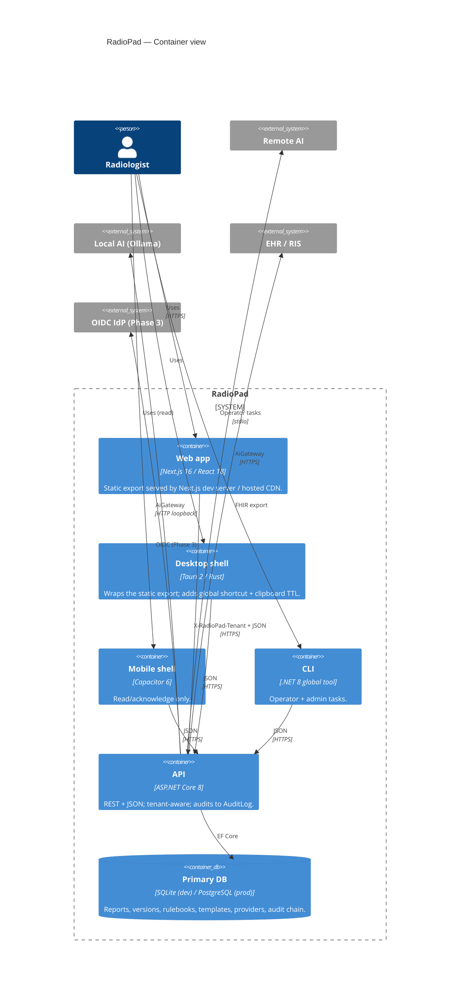

# C4 — Container

**Status:** Current  ·  **Owner:** Engineering  ·  **Last Updated:** 2026-05-04

## Notes

- Web/Desktop/Mobile share the same static export.
- The CLI is privileged-by-headers, not by network — same `X-RadioPad-Tenant` and `X-RadioPad-User` rules apply.
- The DB is single-tenant logically (`TenantId` column) but a single physical instance per deployment.
