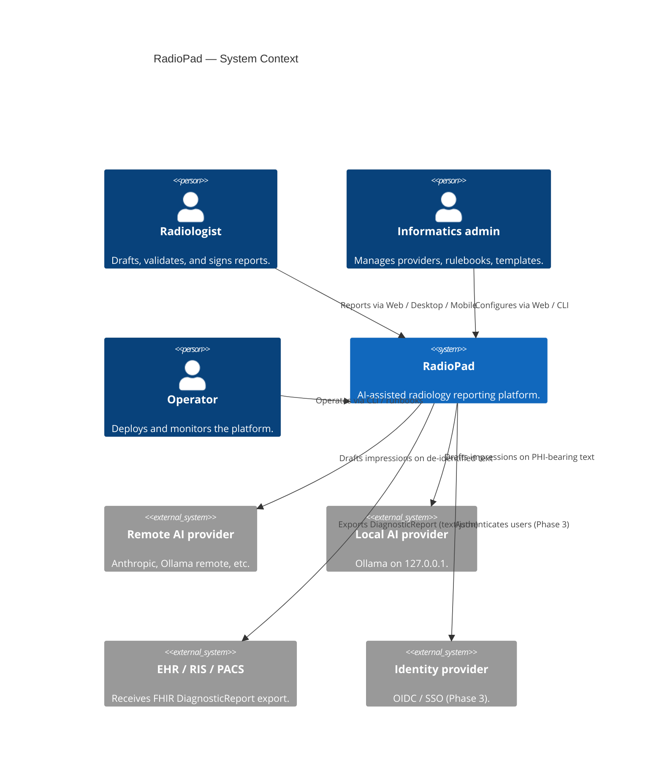

# C4 — Context

**Status:** Current  ·  **Owner:** Engineering  ·  **Last Updated:** 2026-05-04

## System context

## Trust boundaries

- The boundary between RadioPad and a **remote AI provider** is a strong trust boundary. PHI never crosses it unless the provider has compliance class `PhiApproved`.
- The boundary between RadioPad and a **local AI provider** is a soft trust boundary; PHI may cross it because compliance class is `LocalOnly` and the data does not leave the tenant network.
- The boundary between RadioPad and the **EHR** is governed by the customer's interoperability contract; today it is one-way export only.
