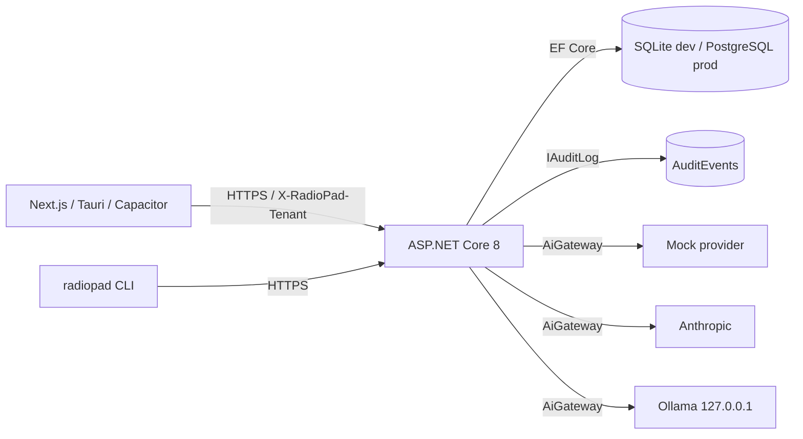

# System Design

**Status:** Current  ·  **Owner:** Engineering  ·  **Last Updated:** 2026-05-04

> Higher-level overview is [architecture.md](architecture.md). C4 views: [c4-context.md](c4-context.md), [c4-container.md](c4-container.md), [c4-component.md](c4-component.md). This file lists services/modules and their responsibilities.

## Modules

| Module | Responsibility | Depends on |
| --- | --- | --- |
| `RadioPad.Domain` | Entities + enums (`Report`, `ReportVersion`, `Tenant`, `User`, `Rulebook`, `ReportTemplate`, `Provider`, `AuditEvent`, severity / status / action / compliance enums). | — |
| `RadioPad.Application` | Services (`AiGateway`, `FhirDiagnosticReportSerializer`), DTOs, provider adapters. | Domain |
| `RadioPad.Validation` | Rulebook engine + YAML schema. | Domain |
| `RadioPad.Infrastructure` | EF Core `RadioPadDbContext`, `AuditLog` (chain), provider key resolver. | Domain, Application |
| `RadioPad.Api` | Controllers, middleware (`RequestCorrelationMiddleware`, `GlobalExceptionMiddleware`), Program. | All above |
| `RadioPad.Cli` | .NET 8 global tool. | Domain, Validation (for local rulebook checks) |
| `frontend` | Next.js App Router; `lib/api.ts` typed client. | Backend HTTP API |
| `desktop` | Tauri 2 shell wrapping `frontend/out`. | frontend |
| `mobile` | Capacitor 6 shell wrapping `frontend/out`. | frontend |

## Runtime interactions

## Scaling assumptions

- Stateless API; horizontal scale behind a TLS load balancer.
- DB scaled vertically before sharding (single tenant ≈ ≤ 500k reports/year).
- Audit log volume ≈ 10–20× report volume (every transition + AI call writes an event).
- Provider adapters are HTTP-only; no long-lived connections.

## Failure modes

- DB outage → readiness probe fails → load balancer drains pod.
- Provider outage → 502 to client; explicit re-selection required (no silent fallback).
- Audit chain corruption → CLI `audit verify` exits non-zero; SEV-1.
- Tenant header missing → controller throws → middleware returns 400.
