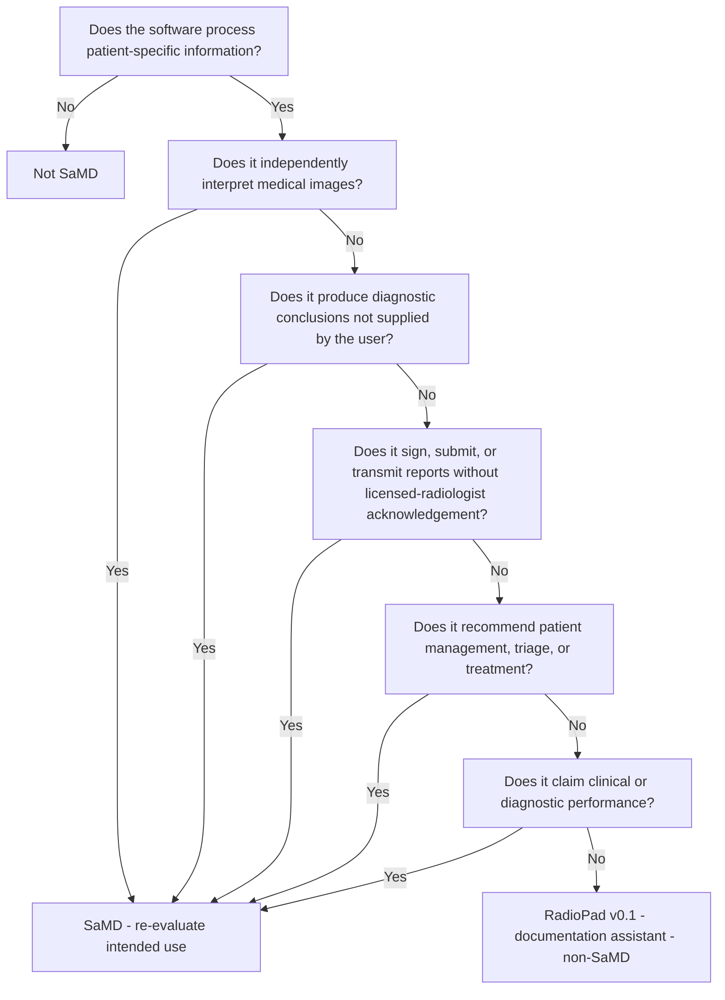

# SaMD Classification (IMDRF N12)

**Status:** Draft  ·  **Owner:** Regulatory  ·  **Last Updated:** 2026-05-04

This document positions RadioPad against the IMDRF *Software as a Medical Device: Possible Framework for Risk Categorization and Corresponding Considerations* (N12) and records the rationale for the v0.1 conclusion that RadioPad is a **non-SaMD documentation assistant**.

## 1. IMDRF risk grid

IMDRF categorises SaMD by combining **State of healthcare situation/condition** (Non-serious / Serious / Critical) with **Significance of the information** the software provides (Inform clinical management / Drive clinical management / Treat or diagnose):

| State \ Significance | Inform | Drive | Treat / Diagnose |
| --- | --- | --- | --- |
| Non-serious | I | I | II |
| Serious | I | II | III |
| Critical | II | III | IV |

## 2. RadioPad AI feature categorisation

The following table maps the **AI-assisted features** in RadioPad to their candidate SaMD class **assuming** the radiologist remains the responsible reader and the report is not signed by the system.

| PRD id | Feature | Significance | State (typical) | Candidate class | Mitigation that keeps the class low |
| --- | --- | --- | --- | --- | --- |
| [RPT-005](traceability-matrix.md) | Generate Impression from Findings | Inform | Serious | I | Output presented as draft, marked `.ai-mark`, requires radiologist acknowledgement (RPT-008, RPT-012). |
| [AI-004](traceability-matrix.md) | PHI / provider compliance routing | Inform | Serious | I | Hard block in `AiGateway.EnforcePhiPolicy`; audited as `ProviderBlocked`. |
| [AI-007](traceability-matrix.md) | Contradiction / validation checks | Inform | Serious | I | Advisory only; radiologist may override; severities are advisory not gating except blockers. |
| [AI-008](traceability-matrix.md) | Unsupported-claim detection | Inform | Serious | I | Advisory, surfaced to the radiologist; does not autonomously edit the report. |
| [RPT-007](traceability-matrix.md) | Style / patient-friendly / referring-summary modes | Inform | Non-serious | I | Pure stylistic transformation of radiologist-authored text. |

**Aggregate position for v0.1:** The information RadioPad provides is **"Inform clinical management"** at most. State of healthcare situation is bounded at Serious for routine reporting (Critical situations exist — e.g. cord compression — but the software still only *informs* the radiologist). The candidate SaMD class is therefore **Class I (lowest)** if SaMD scope were asserted.

Because RadioPad **does not** interpret images, does not produce diagnostic conclusions independent of the radiologist's input, and does not sign or transmit reports without acknowledgement, the v0.1 claim set falls **outside the SaMD definition** as a clinical-documentation productivity tool. Re-classification is required if any of the boundary conditions in §3 are crossed.

## 3. SaMD-vs-non-SaMD decision tree

## 4. Re-classification triggers

The product **must** re-enter regulatory review (and likely become SaMD) if any of the following occur:

1. RadioPad ingests pixel data and produces image-derived findings.
2. RadioPad emits diagnostic conclusions not present in radiologist input.
3. RadioPad auto-signs, auto-submits, or transmits reports without explicit acknowledgement.
4. RadioPad triages worklists, prioritises studies, or recommends patient management.
5. Marketing claims state diagnostic performance, sensitivity, or specificity figures.

Each of these is also a controlled boundary in [intended-use.md](intended-use.md) §6 (Contraindications) and Enterprise PRD §15.2.

## 5. EU AI Act note

Even at non-SaMD scope, RadioPad is a productivity tool used in a healthcare workflow. EU AI Act Annex III §5 lists AI used by public authorities and certain medical contexts as high-risk. Until the legal classification matures, RadioPad will voluntarily implement the high-risk obligations (risk management, data governance, transparency, human oversight, robustness, cybersecurity) — see [ce-mark-checklist.md](ce-mark-checklist.md).
